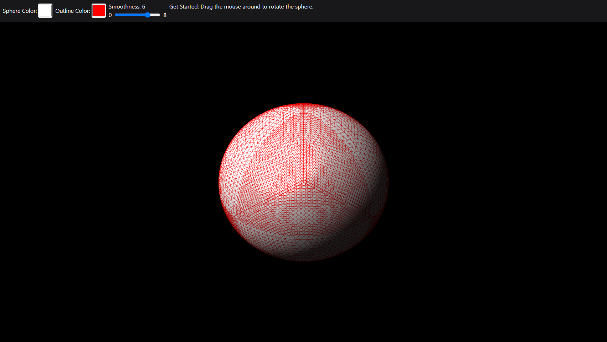

# Module 6
A simple WebGL program that demonstrates an interactive, approximated, and recursively subdivided sphere.

## Usage
1. Ensure you are in the correct directory of the sub-project.
2. Run ```src/index.html``` file in a browser of your choice.
3. Enjoy the program(s).

## Examples


## Notes
The program may not work correctly if WebGL is not supported or if the files are not located where they are expected.
